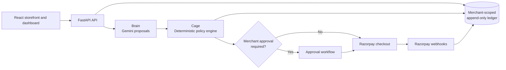
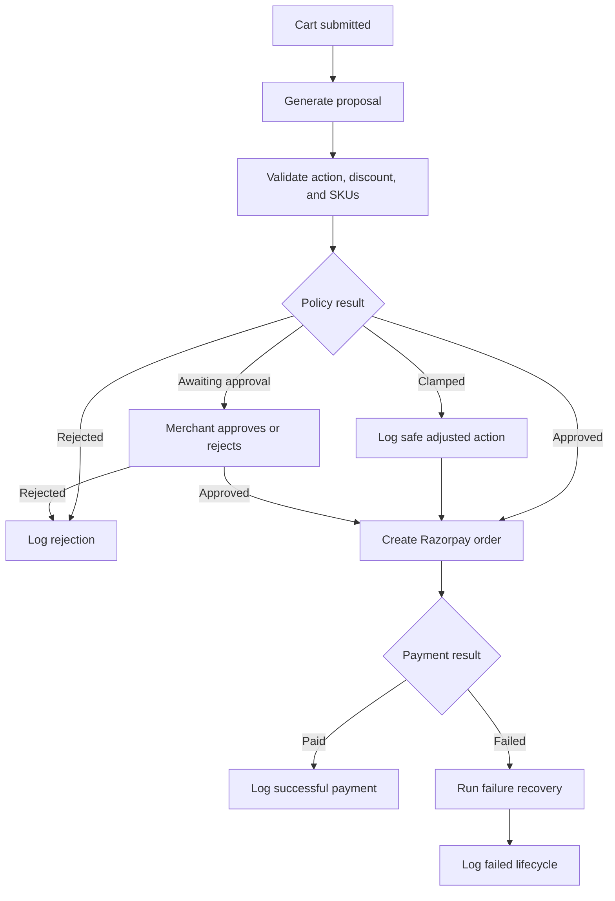

# RazorCage Growth Agent


RazorCage is a multi-tenant AI commerce platform that proposes upsell offers and promotional campaigns for online merchants.

AI-generated proposals are evaluated by a deterministic policy engine before they can affect checkout or payments. Higher-risk discounts require merchant approval, while every proposal, policy decision, payment result, and failure is recorded in an append-only audit ledger.

Built with [React](https://react.dev/), [FastAPI](https://fastapi.tiangolo.com/), [Google Gemini](https://ai.google.dev/), and [Razorpay](https://razorpay.com/docs/).

## Product Overview

The frontend includes onboarding, a storefront, campaign management, approval workflows, analytics, and audit views. Existing visual assets are kept in [frontend/public/onboarding/](frontend/public/onboarding/) and [frontend/public/products/](frontend/public/products/).


## Architecture



The [policy engine](backend/cage/policy_engine.py) is the authority for executable discounts. The AI can suggest an action, but it cannot bypass policy limits, approve its own proposal, or create a payment order directly.

## Checkout Decision Flow



## Highlights

- AI-generated upsell and campaign proposals
- Deterministic discount and SKU validation
- Multi-tenant merchant isolation
- Human approval for higher-value discounts
- Razorpay test-mode checkout integration
- Idempotent checkout and payment operations
- Payment failure recovery
- Campaign scheduling and review
- Analytics and retraining dataset export
- Append-only audit logging with correlation IDs
- Health and readiness endpoints
- Rate limiting and structured logging

## Techniques Used

- **Policy enforcement after AI generation:** proposals are validated and clamped or rejected by a deterministic rules layer. This keeps business-critical decisions outside the LLM.
- **Server-side amount calculation:** checkout totals are calculated from the catalog and approved actions rather than trusted from the client.
- **Idempotent payment operations:** checkout requests can include idempotency keys to reduce duplicate order creation.
- **Correlation-based audit trails:** related checkout and payment events share a correlation ID, making a transaction lifecycle traceable.
- **Multi-tenant request context:** the frontend sends the active merchant through the `X-Merchant-ID` header, while backend services use merchant-scoped data access.
- **Read/write database separation:** ledger writes use a primary connection path and reads use a read-oriented connection path.
- **FastAPI lifespan management:** startup and shutdown hooks initialize databases, seed merchants, start the scheduler, and close resources.
- **Polling for live activity:** dashboard components use [`setInterval()`](https://developer.mozilla.org/en-US/docs/Web/API/Window/setInterval) with cleanup functions from [`useEffect`](https://react.dev/reference/react/useEffect).
- **Browser session state:** merchant selection and demo state use [`sessionStorage`](https://developer.mozilla.org/en-US/docs/Web/API/Window/sessionStorage), keeping state scoped to the browser tab.
- **Live countdowns:** the frontend calculates campaign expiry and progress from UTC timestamps using [`Date`](https://developer.mozilla.org/en-US/docs/Web/JavaScript/Reference/Global_Objects/Date).
- **Frosted glass surfaces:** selected UI elements use [`backdrop-filter`](https://developer.mozilla.org/en-US/docs/Web/CSS/backdrop-filter) for blurred translucent backgrounds.
- **Responsive utility styling:** Tailwind CSS utilities are combined with project-specific CSS classes and animations.
- **Structured API errors:** the shared frontend request helper parses JSON error responses and converts them into application errors.
- **Property-based testing:** the policy engine includes [Hypothesis](https://hypothesis.readthedocs.io/) tests for broader input coverage than example-based tests alone.

## Technologies and Libraries

### Backend

- [Python](https://www.python.org/)
- [FastAPI](https://fastapi.tiangolo.com/)
- [Uvicorn](https://www.uvicorn.org/)
- [Pydantic](https://docs.pydantic.dev/)
- [Google Gen AI SDK](https://github.com/googleapis/python-genai)
- [Razorpay Python SDK](https://github.com/razorpay/razorpay-python)
- [APScheduler](https://apscheduler.readthedocs.io/)
- [HTTPX](https://www.python-httpx.org/)
- [SlowAPI](https://slowapi.readthedocs.io/)
- [Pytest](https://docs.pytest.org/)
- [pytest-asyncio](https://pytest-asyncio.readthedocs.io/)
- [Hypothesis](https://hypothesis.readthedocs.io/)

### Frontend

- [React](https://react.dev/)
- [React DOM](https://react.dev/reference/react-dom)
- [React Router](https://reactrouter.com/)
- [Vite](https://vite.dev/)
- [Tailwind CSS](https://tailwindcss.com/)
- [PostCSS](https://postcss.org/)
- [Autoprefixer](https://github.com/postcss/autoprefixer)
- [Lucide React](https://lucide.dev/guide/packages/lucide-react)

### Fonts

The interface uses [Inter](https://fonts.google.com/specimen/Inter) for general interface text and [JetBrains Mono](https://fonts.google.com/specimen/JetBrains+Mono) for data and ledger content. The font stylesheet is loaded in [frontend/index.html](frontend/index.html).

## Project Structure

```text
├── api/
├── backend/
│   ├── brain/
│   ├── cage/
│   ├── data/
│   │   ├── datasets/
│   │   └── merchants/
│   ├── ledger/
│   ├── routes/
│   ├── services/
│   └── tests/
├── frontend/
│   ├── public/
│   │   ├── onboarding/
│   │   └── products/
│   ├── scripts/
│   └── src/
│       ├── components/
│       ├── hooks/
│       ├── lib/
│       └── pages/
└── scripts/
```

The [backend/brain/](backend/brain/) directory contains Gemini integration and proposal generation. [backend/cage/](backend/cage/) contains deterministic policy evaluation, while [backend/ledger/](backend/ledger/) manages the audit trail.

API route modules live in [backend/routes/](backend/routes/), and business workflows live in [backend/services/](backend/services/). Merchant data, order history, and fine-tuning datasets are stored under [backend/data/](backend/data/).

The frontend page-level views are in [frontend/src/pages/](frontend/src/pages/), reusable interface elements are in [frontend/src/components/](frontend/src/components/), and browser-side utilities are in [frontend/src/hooks/](frontend/src/hooks/) and [frontend/src/lib/](frontend/src/lib/).

Static product and onboarding assets are stored in [frontend/public/](frontend/public/). Deployment-related helpers are in [scripts/](scripts/).
